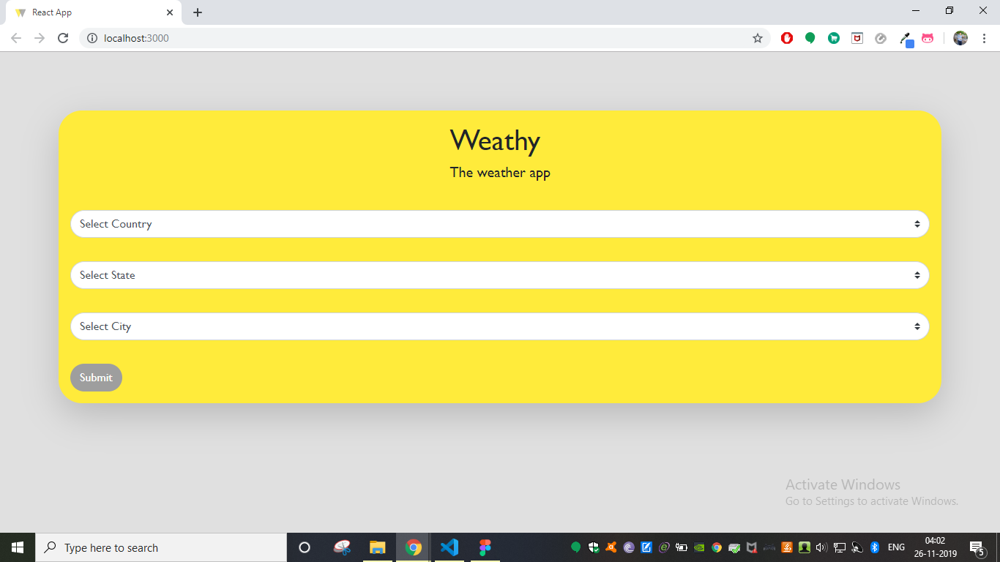
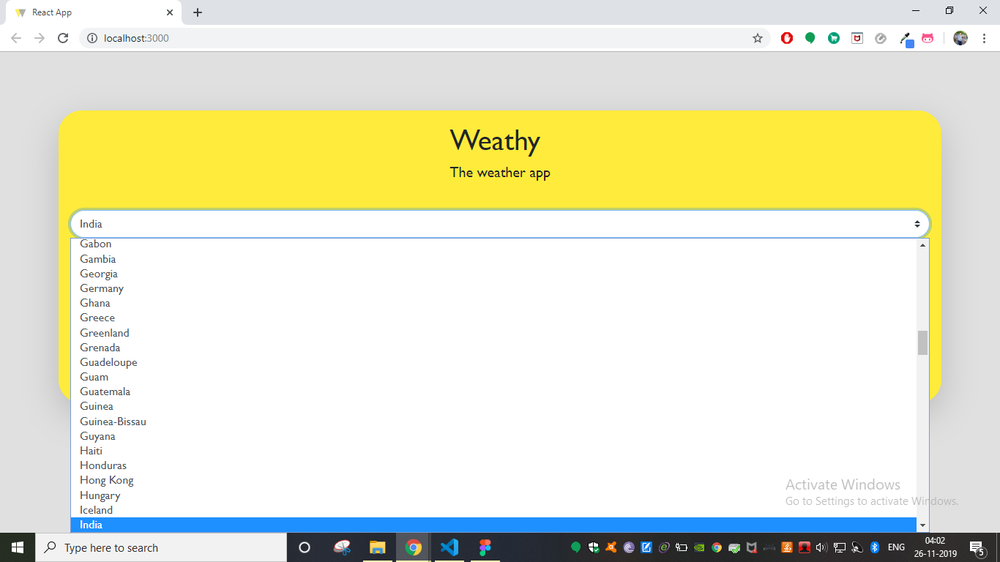
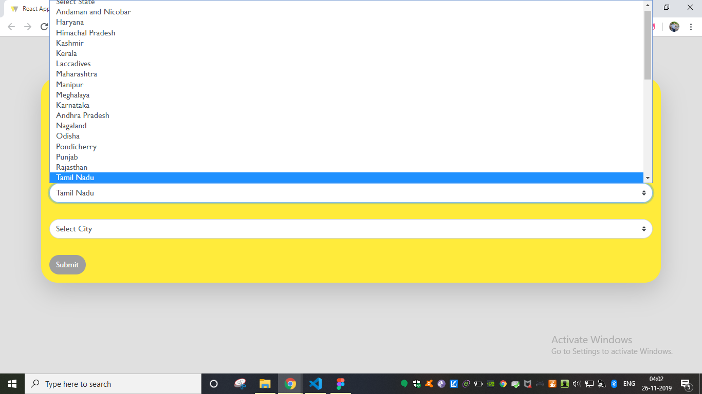
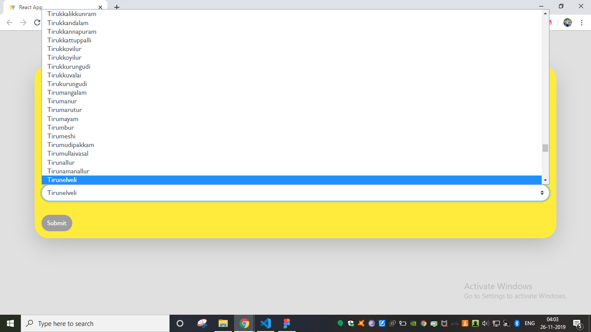
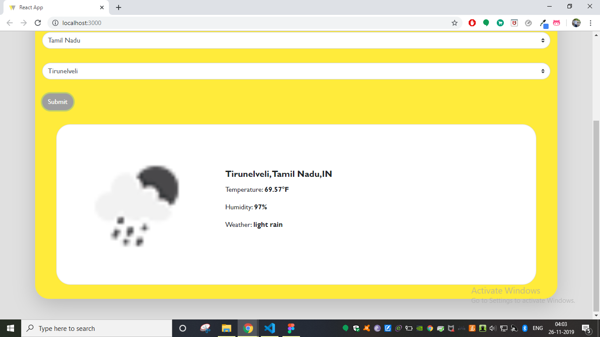

# Weathy
Weather is one of the major factors that affects our day-to-day routine. Starting from a good morning till a lovely night, weather plays an important role. There are tonnes of methods to forecast this weather but only a few brings the result whenever and wherever we want. Weathy is one such a web application, designed to give the forecasted weather result to the end user. It is the updated version of the weather app V 2.0.0

## Getting Started

Follow steps below to download and run this project in local machine
1. Click on 'Clone or download'
2. CLick 'Download ZIP'
3. Extract the .zip file to the preferred location.

### Prerequisites

* html
* css
* javascript
* React

## Working

1.Open the index.js file from the src folder within the project folder and type 'npm start' in the terminal to start the application

2. Select country from the firstinput fiels.

3. Select state from the firstinput fiels.

4. Select city from the firstinput fiels.

5. Submit the form.

6. Result will be displayed at the bottom

## Author

[**Ajith C Ravi**](https://github.com/ajithcravi)
